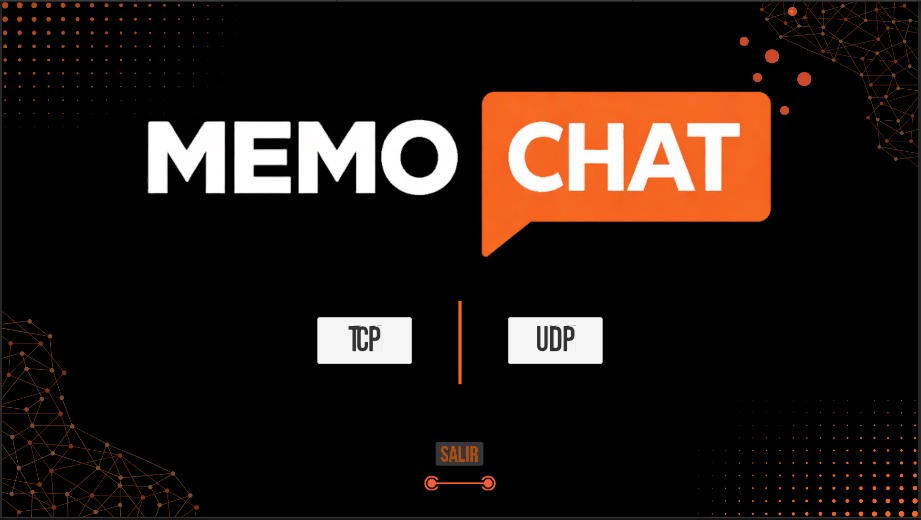
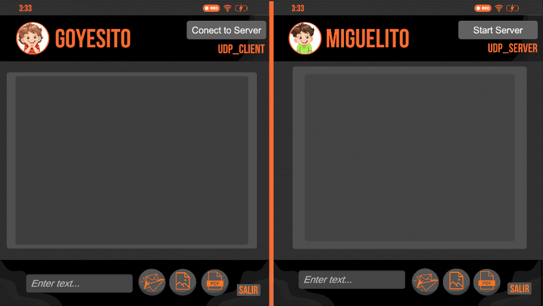
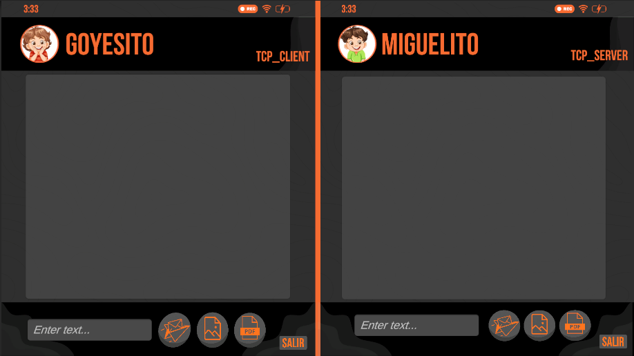

# Chat TCP/UDP con Envío de Mensajes y Archivos en Unity

## Descripción del Proyecto

Este proyecto consiste en el desarrollo de una aplicación de chat implementada en Unity, capaz de comunicarse utilizando dos protocolos de red diferentes: *TCP* y *UDP*.

La aplicación permite la comunicación entre un *cliente y un servidor*, donde los usuarios pueden enviar:

- mensajes de texto
- imágenes
- archivos PDF

Los mensajes se muestran dentro de una interfaz tipo chat utilizando *prefabs dinámicos*, simulando el funcionamiento de aplicaciones de mensajería modernas.

El proyecto fue desarrollado a partir de una base inicial de chat con soporte para TCP y UDP. A partir de esta base se implementaron nuevas funcionalidades como:

- selección manual del protocolo de comunicación
- envío de archivos
- validación del tamaño de archivos
- conexion automatica de cliente y servidor en TCP
- visualización de archivos dentro de la interfaz del chat

El objetivo principal del proyecto es comprender cómo funcionan los protocolos de comunicación en red y cómo pueden integrarse dentro de aplicaciones interactivas desarrolladas con Unity.

---

---

## Componentes principales

| Script | Función |
|------|------|
| TCPClient | Maneja la conexión del cliente utilizando TCP |
| TCPServer | Maneja el servidor TCP y acepta conexiones |
| UDPClient | Maneja el envío de mensajes mediante UDP |
| UDPServer | Recibe mensajes enviados mediante UDP |
| UI_TCPClient | Controla la interfaz del cliente |
| TCPServerUI | Controla la interfaz del servidor |
| ChatUIManager | Administra la visualización de mensajes en el chat |

---

# Explicación de TCP y UDP

## TCP (Transmission Control Protocol)

TCP es un protocolo de comunicación *orientado a conexión*. Esto significa que antes de enviar datos se establece una conexión entre cliente y servidor.

Características principales de TCP:

- Garantiza la entrega de los datos
- Mantiene el orden correcto de los paquetes
- Incluye control de errores
- Es más confiable pero más lento

TCP se utiliza comúnmente en:

- páginas web
- transferencia de archivos
- aplicaciones de mensajería

## UDP (User Datagram Protocol)

UDP es un protocolo sin conexión, lo que significa que los datos se envían directamente sin establecer una conexión previa.

### Características principales de UDP:

- Mayor velocidad
- No garantiza la entrega de los datos
- No asegura el orden de los paquetes
- Menor sobrecarga de red

### Comparación entre TCP y UDP:

| Característica       | TCP           | UDP          |
|---------------------|---------------|--------------|
| Conexión            | Sí            | No           |
| Garantía de entrega | Sí            | No           |
| Orden de paquetes   | Garantizado   | No garantizado|
| Velocidad           | Media         | Alta         |

### Usos comunes de UDP:

- Videojuegos en línea
- Streaming
- Aplicaciones en tiempo real

Debido a las limitaciones de UDP, se implementó un sistema que valida el tamaño de los archivos enviados para evitar errores en la transmisión.

---

## Envío de Mensajes

Los mensajes de texto se envían como cadenas utilizando codificación UTF-8.

Cuando el usuario escribe un mensaje en la interfaz y presiona el botón de enviar, el sistema ejecuta el método de envío correspondiente al protocolo seleccionado.

## Envío de Archivos

El sistema permite enviar distintos tipos de archivos dentro del chat.

### Envío de imágenes

El proceso de envío de imágenes sigue los siguientes pasos:

1. El usuario selecciona una imagen desde el explorador de archivos.
2. El archivo se convierte en un arreglo de bytes.
3. Se verifica el tamaño del archivo.
4. Si el archivo no supera el límite permitido, se envía al servidor.

Las imágenes válidas se muestran en el chat mediante un prefab de imagen.  
Si la imagen supera el límite permitido, el sistema muestra un mensaje en el chat indicando que el archivo no puede enviarse.

---

### Envío de archivos PDF

Para los documentos PDF se implementó un sistema más simple.  
En lugar de enviar todo el archivo, el sistema envía el nombre del documento, lo cual permite representarlo dentro del chat.

#### Formato del mensaje enviado:

PDF|nombreArchivo.pdf

#### Visualización en el chat:

📄 documento.pdf

Esto permite mostrar los documentos enviados sin necesidad de transmitir archivos grandes durante las pruebas.

---

## Interfaz del Chat

La interfaz fue construida utilizando los componentes de UI de Unity:

- ScrollView
- Vertical Layout Group
- Content Size Fitter
- Prefabs dinámicos

### Tipos de prefabs utilizados:

| Prefab        | Descripción                          |
|---------------|--------------------------------------|
| Message       | Mensajes recibidos y enviados        |
| ImageMessage  | Prefab utilizado para mostrar imágenes|
| PDFMessage    | Prefab utilizado para representar documentos PDF|

Los prefabs se instancian dinámicamente cada vez que se recibe o envía un mensaje, lo que permite que la interfaz del chat se adapte automáticamente al contenido.

---

## Proceso de Investigación

Durante el desarrollo del proyecto se realizó una investigación sobre diferentes técnicas para transmitir archivos en aplicaciones de red.

### Temas principales:

#### Transmisión de archivos

Se analizaron diferentes métodos para enviar archivos entre cliente y servidor:

- Conversión de archivos a Base64
- Transmisión de archivos como byte arrays
- Envío de metadatos del archivo

Se decidió utilizar la conversión a bytes para las imágenes y un sistema simplificado para los archivos PDF.

#### Limitaciones de UDP

Se investigaron las limitaciones del protocolo UDP, especialmente relacionadas con el tamaño máximo de los paquetes.  
Se implementó un sistema de validación que evita enviar archivos demasiado grandes.

#### Interfaces dinámicas en Unity

Se investigó cómo construir interfaces dinámicas utilizando:

- Prefabs
- Layout groups
- Scroll views

Esto permitió desarrollar un sistema de chat flexible que se adapta automáticamente a diferentes tipos de contenido.

---

## Integración con la Base Entregada

El proyecto fue desarrollado a partir de una base inicial de chat con soporte para TCP y UDP.  

### Mejoras implementadas:

- Soporte para envío de archivos
- Visualización de imágenes dentro del chat
- Soporte para documentos PDF
- Validación del tamaño de archivos
- Mejoras en la interfaz del usuario

Estas modificaciones ampliaron la funcionalidad del sistema manteniendo la arquitectura de red establecida.

---

## Instrucciones de Ejecución

### Requisitos

- Unity 6.0 o superior
- Visual Studio o Visual Studio Code
- Sistema operativo Windows

### Pasos para ejecutar el proyecto

1. Clonar el repositorio: `git clone https://github.com/Guemig/Chat-TCP-UDP-base`
2. Abrir el proyecto en Unity.
3. Ejecutar primero la escena de seleccion de chat.
4. Conectar el cliente al servidor utilizando los botones de la interfaz.
5. Enviar mensajes o archivos utilizando la interfaz del chat.

---

## Capturas de Pantalla

### Interfaz seleccion de Chat

### UDP

### TCP

### Video de Demostración

El funcionamiento del sistema puede observarse en el siguiente video:

[Ver video de demostración](https://youtu.be/6YmlFmrttTM)

---

## Conclusiones

Este proyecto permitió implementar un sistema de comunicación cliente-servidor utilizando dos protocolos de red diferentes.  

Durante el desarrollo se lograron integrar funcionalidades como:

- Envío de mensajes de texto
- Envío de imágenes
- Representación de documentos PDF
- Validación de archivos
- Interfaz de chat dinámica

Además, el proyecto permitió comprender mejor cómo funcionan los protocolos de red y cómo pueden utilizarse dentro de aplicaciones interactivas desarrolladas con Unity.

---

## Autor

Proyecto desarrollado por:

**Juan David Goyeneche**
**Luis Miguel Guerrero**
